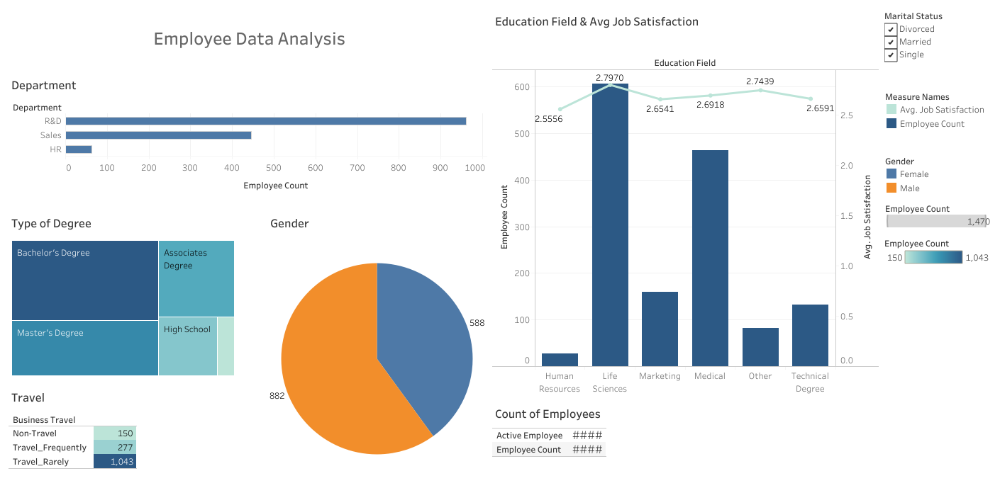

# HR Lens: Employee Trends Analysis using Tableau 

This repository contains Tableau dashboard, visualization, and data analysis projects I have created. 

 ## Project Description

 This interactive Tableau dashboard was created to visualize and analyze HR data to derive insights into the employee base. The key goals were to:
 
 - Provide analysis of employee distribution across business units and roles
 - Identify trends in demographics like age, gender, education level
 - Evaluate employee satisfaction and engagement metrics
 - Analyze factors related to employee attrition and turnover
 - Enable data-driven decision making around HR initiatives

The dashboard brings together employee data from various HR systems into a unified view. It allows slicing and dicing the data by departments, demographics, job attributes and other dimensions.

Some key visualizations include:

- Headcount and demographics analysis
- Employee spread by business unit, job function
- Satisfaction scoring trends over time
- Attrition rates by age, gender, job role
- Compensation and performance analysis
- HR KPIs and metrics

## Analyzing Employee Trends

## About Tableau

Tableau is a powerful data visualization and business intelligence tool. Some key features:

- Drag and drop interface to build interactive dashboards 

- Broad data connectivity to combine data sources 

- Diverse visualization types including maps, charts, graphs etc.

- Smart analytics with trendlines, forecasting, clustering etc.

- Sharing capabilities for visualizations and dashboards

## How to Use

1. Download and install Tableau Desktop
2. Download the .twbx file for any project
3. Open the file in Tableau to interact with the visualizations
4. Connect to your own data sources to create custom dashboards
